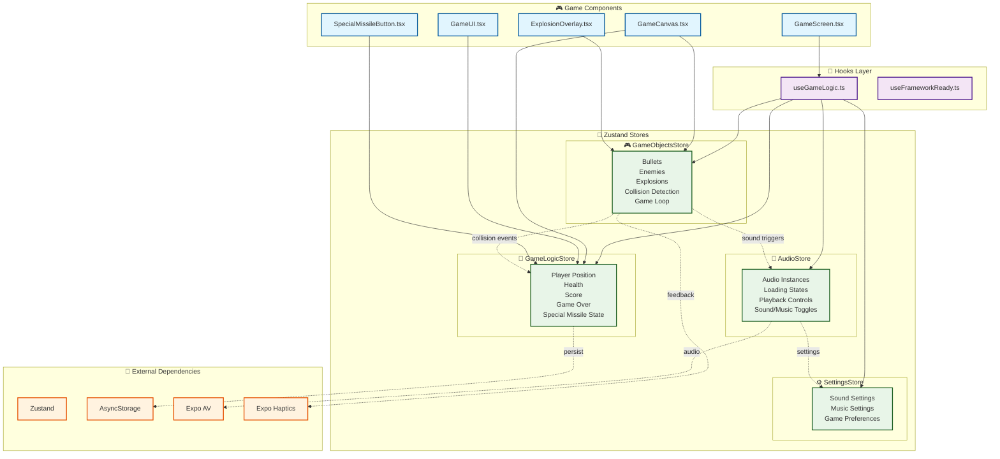
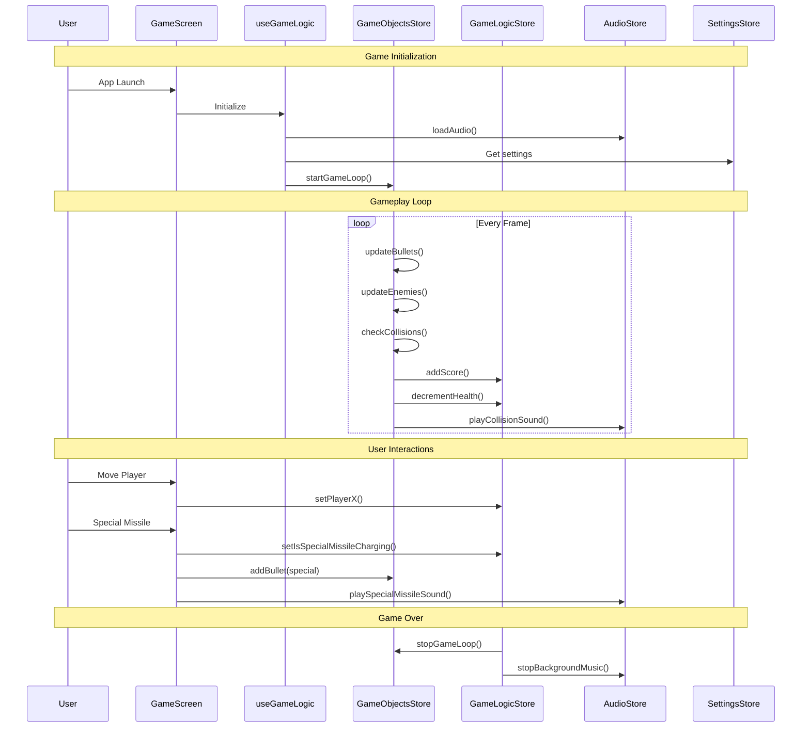
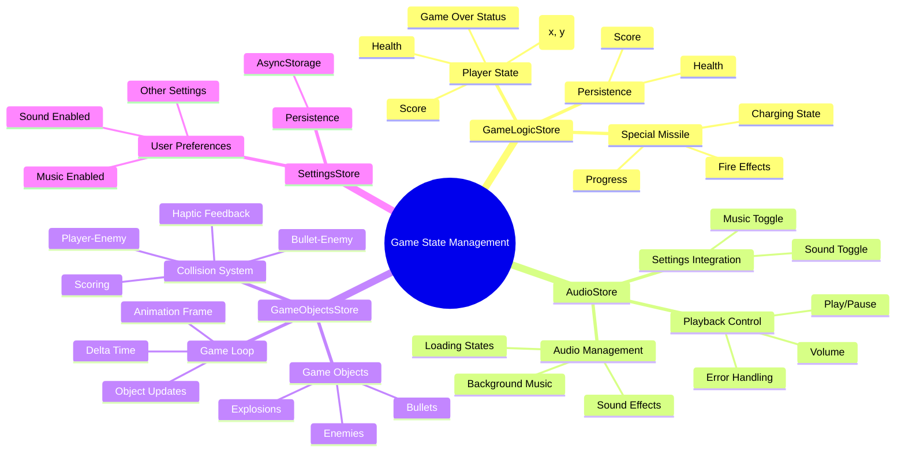

# Game State Management Refactoring

This document tracks the gradual refactoring of the game's state management from React hooks to Zustand stores.

## 🏗️ State Management Architecture

## 🔄 Data Flow Diagram

## 🎯 Store Responsibilities

## ✅ Completed Refactorings

### 1. GameLogicStore (Core Game State)
- **Created**: `stores/GameLogicStore.ts`
- **Purpose**: Manages core game state (player position, health, score, game over) and special missile state
- **Persistence**: Score and health only

### 2. AudioStore (Audio Management)
- **Created**: `stores/AudioStore.ts`
- **Purpose**: Manages audio instances, loading states, and playback
- **Features**: Loading state management, error handling, sound/music toggles

### 3. GameObjectsStore (Comprehensive Game Objects)
- **Created**: `stores/GameObjectsStore.ts`
- **Purpose**: Unified management of all game objects and their interactions
- **Consolidated**:
  - ✅ Bullets (spawning, movement, removal)
  - ✅ Enemies (spawning, movement, collision handling)
  - ✅ Explosions (creation, removal)
  - ✅ Collision Detection (bullet-enemy, player-enemy)
  - ✅ Game Loop (unified animation frame management)

## 🏗️ Current Architecture

### Stores
1. **GameLogicStore** - Core game state and special missile
2. **AudioStore** - Audio management and playback
3. **GameObjectsStore** - All game objects and interactions
4. **SettingsStore** - Game settings and preferences

### Hooks
- **`useGameLogic`** - Main orchestrator hook that uses all stores
- **`useFrameworkReady`** - Framework initialization

## 🎯 Benefits Achieved

### Performance
- ✅ Unified game loop instead of multiple useEffect loops
- ✅ Reduced re-renders through centralized state
- ✅ Better memory management

### Architecture
- ✅ Single source of truth for game objects
- ✅ Clean separation of concerns
- ✅ Eliminated complex hook dependencies
- ✅ Centralized collision detection logic

### Developer Experience
- ✅ Easier debugging with centralized state
- ✅ Cleaner component interfaces
- ✅ Better TypeScript support
- ✅ Simplified state management

## 🔧 Technical Improvements

### Game Loop Optimization
- **Before**: Multiple `useEffect` loops for bullets, enemies, collisions
- **After**: Single unified game loop in `GameObjectsStore`

### Collision Detection
- **Before**: Separate collision logic in `useCollisionDetection`
- **After**: Integrated collision detection in `GameObjectsStore`

### State Management
- **Before**: Complex hook interdependencies
- **After**: Clean store-based architecture
